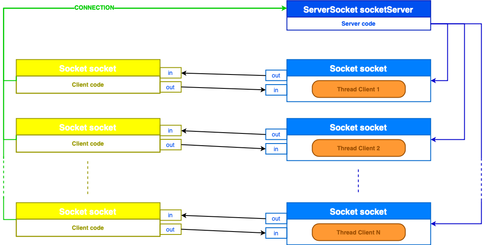

# Battleship.
This project implement the Battleship game with both a client-server application and an HTTP server using Java language and more precisely Java Sockets. 

# Table of content.
- [Client-Server application.](#client-server-application)
   * [Usage.](#usage)
   * [Software architecture.](#software-architecture)
   * [Multi-thread coordination.](#multi-thread-coordination)
   * [Limits.](#limits)
- [HTTP server.](#http-server)
   * [Usage.](#usage-1)
   * [Software architecture.](#software-architecture-1)
   * [Limits.](#limits-1)

## Client-Server application.

### Usage.
The software is invoked on the command line with no additional arguments `java BattleshipServer` for the server and `java BattleshipClient` for the client.

* **Client side:** A small menu is propose to the client 
  ```
  1) Try a tile
  2) See game status
  3) Quit
  ```
  The first choice permit to enter a grid location of a Battleship shoot. The format of the try is `XY` where `X` is a letter from `A` to `J` representing a grid line and `Y` is a number between `0` and `9` indication the grid column of the shoot. The second choice permit to display the current grid game status in the client side while the last choice stop the current part.

* **Server side:** on the server output console, the position of the ships are display on the game grid for easier
testing.
### Software architecture.

This software consists of six classes that are briefly described below
  * **`Boat:`** define the boats placed on the Battleship game grid.
  * **`Grid:`** define the grid of the Battleship game. It was decided to model the ocean of this game as a two-dimensional array of bytes. Boats are placed on the grid<sup>[1]</sup> by setting there location to there ID (define in the `ConstantsConversion` class), the latter been also of type byte.
  * **`BattleshipServer:`** initialize the client-server connection and then launch a Battleship thread for each connected client.
  * **`BattleshipClient:`** manage user requests and then communicate with the server
to handle the battleship game. This class also check the validity of every client
request in order to not send erroneous messages to the server.
  * **`Battleship:`** this class extend the Thread class, define in the java.lang package. After the connection between the client and the server accepted, an new thread Battleship will be create for each connected client. It is this class who manage the client request and who is sending the appropriate response message to its client.
  * **`ConstantsConversion:`** contain all game settings, ID and size convention of boats and messages and some conversion tool for locations display and inputs. This class is required by both client and server implementation.

The figure 1 illustrates a typical display of the battleship game grid. As you can see, the board is just a 10x10 array of numbers. The `ConstantsConversion` class defined boats ID from 1 to 5, one for each boats type. It was decided to define a miss shot by "-6" and a hit shot by the negative touched boat ID. The miss shot identifier is also alterable from the `ConstantsConversion` class. In this example, the user already try a shot in position A0 and C4 (a miss and a hit).

<p align="center">
  <br>
  Fig. 1: Typical display of the game’s grid.
</p>

### Multi-thread coordination.
On figure 2 it can be see that the server initialize a `ServerSocket`. After what, in the server code, a Socket is initialize and each time that the server accept a client connection, it launch a corresponding Thread which are implemented in
the `Battleship` class. Note that it launch this last by giving it Socket and `clientID` in argument. So each client has its own Tread, they are all independents from each other. The client **N** is only able to access the status of the game manage by the Thread **N**. The communication between clients and threads are provided by the `OutputStream` and the `InputStream` object instantiated in the client code and in the thread itself. These objects are relative to the same port (define in the `ConstantsConversion` class).

<p align="center">
  <br>
  Fig. 2: Server-Client message exchange and Thread architecture.
</p>

### Limits.
* The implementation was able to connect up to 40 customers, after what a new connection attempt was declined by the server<sup>[2]</sup>. 

* The `ConstantsConversion` provide 2 functions who convert the integer from 0 to 9 in there corresponding alphabetic character from A to J and conversely from the character to the corresponding integer. However, ifwewant to enlarge the grid game size, these functions should be update by adding new integer and their corresponding Unicode character. A better way to implement this conversion function would have been to use ASCII conversion by adding integer to the hexadecimal representation
of these characters in order to extract their corresponding places in the alphabetic order.

## HTTP server.
### Usage.
The server software is invoked on the command line with one additional argument:
```
java WebServer maxThreads
```
where `maxThreads` is the maximum number of Java Threads that can be run in a concurrent way to handle the requests. One can also see this argument as the maximum number of requests that can be treated “simultaneously”.

The server waits for `TCP` connections on a given port, and can handle `HTTP GET` and `HTTP POST` requests through that connection when established. Every HTML page returned by your server does not correspond to a file on disk, but is
dynamically generated in your Java source code. A `HTTP GET` method is used to:
* Request the `root` page, the `play.html` page or the `halloffame.html` of the server.
* Request an evaluation of the coordinates selected by the user through an `AJAX` request. The server would then respond to this `AJAX` request by providing the number corresponding to the ship that was hit, or 0 if no ship was present at that
location.
* A `HTTP POST` method is used to request an evaluation of the coordinates in the case where Javascript is disabled on the browser.

The `play.html` page is the main page. This is where the user interacts with the server through the browser to play the game. The `halloffame.html` page is a Hall of Fame, where the 10 best players are displayed. Each player is identified by his/her
session cookie, and the score is the number of tries used to sink all ships (the less the better).

A client browser can connect to the server using the url
```
http://localhost:8028/RequestedContent
```
where 8028 is the default port of the implementation that can be modify from the `ConstantConversion.java` files and `RequestedContent` can be either the root `\`, `play.html` or `halloffame.html`.


### Software architecture.
A complete diagram of how the Battleship web server has been implemented
can be seen in figure 3. This implementation is made of 10 Java files which are
* **Message relatives:** `webServer.java`, `Battleship.java`, `HTTPRequest.java`.
* **Game relatives:** `Grid.java`, `Boat.java`, `Cookie.java`, `Fame.java`.
* **Page code relatives:** `HTMLGenerator.java`, `HTMLErrorGenerator.java`.
* **General:** `ConstantsConversion.java`, `play.html`, `halloffame.html`.
These are briefly describe above. 

* **`Grid`:** define the grid of the Battleship game. It was decided to model the ocean of this game as a two-dimensional array of bytes. Boats are placed on the grid by setting there location to there ID (define in the `ConstantsConversion` class), the latter been also of type byte.
* **`Boat`:** define the boats placed on the Battleship game grid.
* **`Fame`:** define a client whose score appears in the hall of fame, which one has been implemented as a public `ArrayList`. This array list have a limited size of 10 items managed by the `hallOfFameManager()` method.
* **`Cookie`:** because the Java package `javax.servlet.http.Cookie` is not available in all systems, the `Cookie` class has been implemented for this server. A `Cookie` is simply define by a `String` object and set at the first client’s connection. Note that its value is recovered in the header of the client’s first request (method `GET` for an HTML page) under its `"Cookie"` field. This class will especially help to associate a client to his `Grid` because `Cookies` are unique.
* **`webServer`:** manage the `hallOfFame` and `actifGrid` public `ArrayList` whose names are quite evocative:
     - **`hallOfFame`:** contains the 10 best scores made in a Battleship web game since the server has been start;
     - **`actifGrid`:** contains the current list of all grid game of clients having connected since the launch of the server;
     
     The `webServer` also launch a `Battleship` when he detect a request on the socket it’s listening. It manage these `Battleship` (actually being Threads) by initializing a pool of these of fixed size. This size is given by by a user in the server launch so it will also check this argument’s validity.
* **`Battleship`:** as say upper, the `Battleship` class is in fact an implementation of the `Runnable` interface (i.e. a Thread). This class manage client requests by replying the appropriate message (HTML page, ID of the touched boat, HTML error page,...) to a client HTTP demand.
* **`HTTPRequest`:** read a client HTTP request<sup>[3]</sup> and initialize/update game variables based on its content. This class also recovers from this client message some useful variables to formulate the server response. This class not only reads the message but also checks the validity of its content, and in case of trouble it inform the `Battleship` object about the nature of the error using the error variable. `Battleship` will then manage this error, often by sending an HTML error page.
* **`HTMLGenerator`:** generate the requested HTML page by the client. This page can be `halloffame.html` or `play.html`. They are demanded by the client either at its connection or during a request by form using method `POST`.
* **`HTMLErrorGenerator`:** generate an error page if any error occurs during the HTTP request treatment.
* **`ConstantsConversion`:** contain all game settings, ID and size convention of boats and messages, some conversion tool for locations display and inputs and all defined error codes and HTTP header field<sup>[3]</sup>.

<p align="center">
  <br>
  Fig. 3: General architecture of the Battleship HTTP server implementation.
</p>

### Limits.
Client's cookie expire after 30 minutes of client inactivity. 
Another trouble in this implementation occur during browser queries. Whether one attempts to communicate through a `POST` method of a form or a `GET` method of a JavaScript code, from time to time some little bugs occurs and the user request is not even send to the server. However, during all our development it was impossible for us to correct these and these two methods still work most of the time.
The `maxThreads` values, which set the maximum number of thread working together, has been limited at 20 for security reasons.

<sup>[1]</sup> : In order to simplify the communication between client and server, a maximum of variables have been defined in byte type.

<sup>[2]</sup> Tested on a MacBook Air (13-inch, Early 2014), processor 1,4 GHz Intel Core i5.

<sup>[3]</sup> Defined in RFC2616, https://www.ietf.org/rfc/rfc2616.txt


