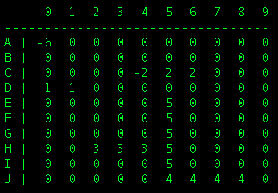
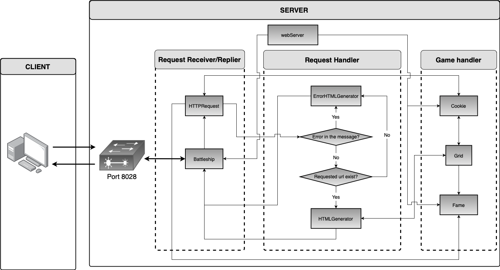

# Battleship
This project implement the Battleship game with both a client-server application and an HTTP server using Java language and more precisely Java Sockets. 

## Client-Server application
This document is intended to people who have read these following files: Battleship.java, BattleshipClient.java,
BattleshipSer- ver.java, Boat.java, ConstantsConversion.java and Grid.java. As explain later, the Battleship class
being an implementation of the Runnable interface relative to the method BattleshipServer, when we will speak of the
server we will often refer to this Battleship.java file.

### Software architecture.

This software consists of six classes that are briefly described below
  * **Boat:** define the boats placed on the Battleship game grid.
  * **Grid:** define the grid of the Battleship game. It was decided to model the ocean of this game as a two-dimensional array of bytes. Boats are placed on the grid[1] by setting there location to there ID (define in the ConstantsConversion class), the latter been also of type byte.
  * **BattleshipServer:** initialize the client-server connection and then launch a Battleship thread for each connected client.
  * **BattleshipClient:** manage user requests and then communicate with the server
to handle the battleship game. This class also check the validity of every client
request in order to not send erroneous messages to the server.
  * **Battleship:** this class extend the Thread class, define in the java.lang package. After the connection between the client and the server accepted, an new thread Battleship will be create for each connected client (see section 2). It is this class who manage the client request and who is sending the appropriate response message to its client.
  * **ConstantsConversion:** contain all game settings, ID and size convention of boats and messages and some conversion tool for locations display and inputs. This class is required by both client and server implementation.

The figure 1 illustrates a typical display of the battleship game grid. As you can see,
the board is just a 10  10 array of number. The ConstantsConversion class defined
boats ID from 1 to 5, one for each boats type. I decide to define a miss shot by
"-6" and a hit shot by the negative touched boat ID. The miss shot identifier is also
alterable from the ConstantsConversion class. In this example, the user already try a
shot in position A0 and C4 (a miss and a hit).

  
  <figcaption> Fig. 1: Typical display of the game’s grid.</figcaption>

.caption[

Once the problem of the implementation of the battleship itself solved, different
concerns have arisen on the side of communication between the client and
the server. The first problem I encountered during my test was that both the server
and the client was unable to detect the disconnection on the other side. I solve
this problem by creating my own read() and write() methods with there own
try{...}catch(Execption e){...} blocks different from that of the main method.
  

  
  
  
[1] : In order to simplify the communication between client and server, a maximum of variables have been defined in byte type.

